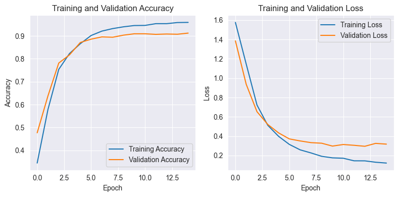
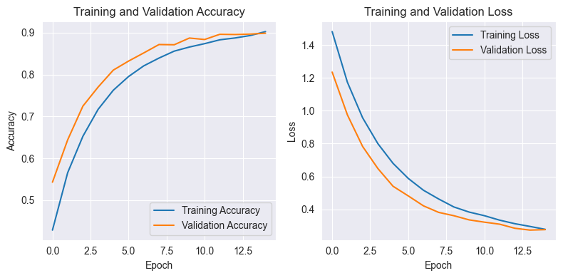

## 情緒識別 LSTM 模型

專案介紹
---
此項目為使用 LSTM 神經網絡來識別文本中的情緒  
目標：準確預測文本表達的情緒，如快樂、憤怒、驚訝等。

項目架構
---
```
emotion-detection-lstm/
├── originaldataset/ # 存放原始資料
├── usedataset/ # 存放預處理好的資料
├── preprocessing/ # 資料預處理腳本
│ ├── preprocessing.ipynb # 停用詞處理
│ └── txtTOcsv.ipynb # 將.txt轉換為.csv
├── Training/ # 模型訓練
│ ├── LSTM-glove.ipynb # LSTM Model訓練
│ └── LSTM-model.ipynb # LSTM Model+GloVe向量模型進行訓練
├── output_pic/ # 可視化資料圖檔
├── glove.6B.100d.txt
├── requirement.txt # 執行環境
└── README.md # 項目文檔
```

資料集
---
有三個主要的資料集文件：`train.txt`，`test.txt`和`val.txt`。  
其中欄位：

|   欄位    | 定義 |
|:-------:|:--:|
|  text   | 句子 |
| emotion | 情緒 |


預處理
---
`txtTOcsv.ipynb`格式轉換：將.txt轉換為.csv  
`preprocessing.ipynb`資料清洗：去除停用詞、標點符號、低頻詞

模型訓練
---
使用LSTM模型，資料準備
使用 Tokenizer 從Keras來對文本進行分詞並建立詞彙表
- 分詞：將所有句子分解成單詞，使用 Tokenizer 從Keras來對文本進行分詞。  
- 建立詞彙表：從訓練集中創建一個詞彙表，將每個唯一單詞映射到一個整數索引。  
- 文本向量化：將每個句子轉換成整數序列，這些整數代表對應單詞的索引。  
- 序列填充：因為LSTM模型需要固定長度的輸入，我們將使用填充來確保所有輸入序列都有相同的長度。

1. **LSTM `LSTM-model.ipynb`**
    ```
    Model: "sequential"
    _________________________________________________________________
     Layer (type)                Output Shape              Param #   
    =================================================================
     embedding (Embedding)       (None, 34, 34)            340000    
                                                                     
     dropout (Dropout)           (None, 34, 34)            0         
                                                                     
     lstm (LSTM)                 (None, 32)                8576      
                                                                     
     dropout_1 (Dropout)         (None, 32)                0         
                                                                     
     dense (Dense)               (None, 16)                528       
                                                                     
     dense_1 (Dense)             (None, 6)                 102       
                                                                     
    =================================================================
    Total params: 349206 (1.33 MB)
    Trainable params: 349206 (1.33 MB)
    Non-trainable params: 0 (0.00 Byte)
    _________________________________________________________________
    ```
2. **LSTM+GloVe `LSTM-glove.ipynb`**   
使用 GloVe 預訓練詞嵌入和 LSTM 層構建構模型
    ```
    Model: "sequential"
    _________________________________________________________________
     Layer (type)                Output Shape              Param #   
    =================================================================
     embedding (Embedding)       (None, 34, 100)           1535800   
                                                                     
     lstm (LSTM)                 (None, 32)                17024     
                                                                     
     dropout (Dropout)           (None, 32)                0         
                                                                     
     dense (Dense)               (None, 16)                528       
                                                                     
     dense_1 (Dense)             (None, 6)                 102       
                                                                     
    =================================================================
    Total params: 1553454 (5.93 MB)
    Trainable params: 17654 (68.96 KB)
    Non-trainable params: 1535800 (5.86 MB)
    _________________________________________________________________
    ```


訓練結果
---
**LSTM-model**

```
Test Accuracy: 89.95%
Test Loss: 29.87%
```
**LSTM-GloVe**

```
Test Accuracy: 90.60%
Test Loss: 24.85%
```
LSTM-model在測試集上達到了 89.95% 的準確率  
LSTM-GloVe在測試集上達到了 90.60% 的準確率

結論
---
模型的性能證明了使用 LSTM 對於情緒分類的有效性。  
證明使用GloVe預訓練詞向量模型提高了模型性能，提高1%準確率、下降接近5％的loss。  
並由上圖可看出：  
LSTM-GloVe具備更好的泛化能力，展現了非常理想的模型訓練過程。  
驗證指標與訓練指標非常接近，且沒有過擬合現象。

---

感謝您關注這個項目。如果您有任何建議或問題，請隨時開啟 issue 或提交 pull request。
